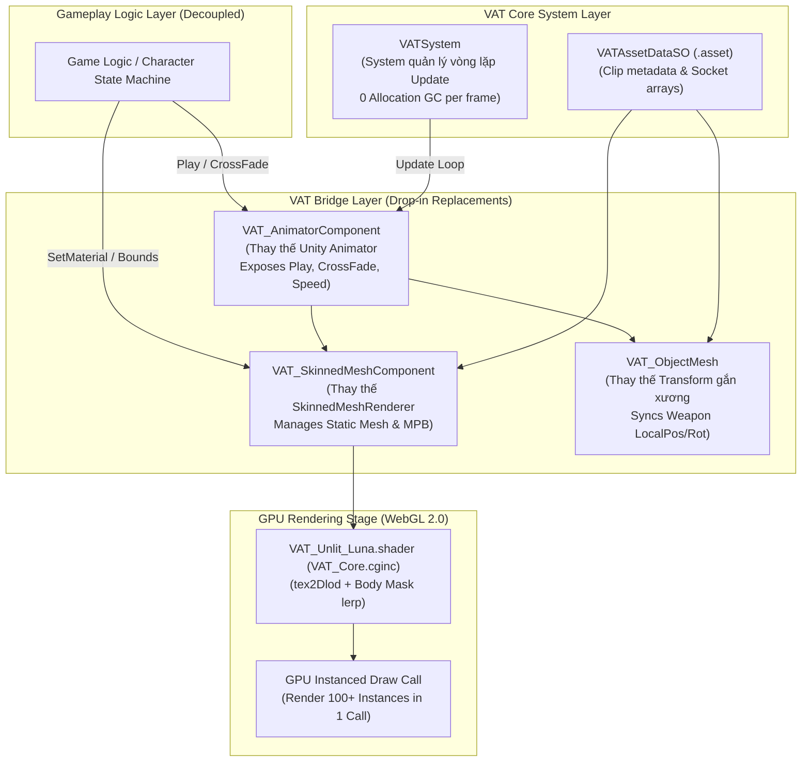

# Báo Cáo Nghiên Cứu Chuyên Sâu: Vertex Animation Texture (VAT) Trên Luna Playable (WebGL 2.0)

## 1. Kiến Trúc Độc Lập & Các Component Bridge Thay Thế (System-Component-Structure)

Hệ thống VAT được xây dựng theo kiến trúc decoupled hoàn toàn độc lập với logic gameplay. Gameplay chỉ cần tương tác với các **Bridge Component** thay thế trực tiếp các Unity API truyền thống:



---

## 2. Chi Tiết Các Component Bridge Thay Thế

### A. `VAT_AnimatorComponent` ([VAT_AnimatorComponent.cs](file:///c:/PlayableProject/Playable_RPG_Game_Checker/Assets/Optimized-Feature/Scripts/VAT_AnimatorComponent.cs))
- **Đại diện thay thế cho**: Component `Animator` mặc định của Unity.
- **Cung cấp API tương thích**:
  - `Play(string stateName)`
  - `CrossFade(string stateName, float transitionDuration)`
  - `Speed` (điều chỉnh tốc độ hoạt họa)
  - `IsBlending` (kiểm tra trạng thái đang chuyển đổi)
- **Chức năng**: Tính toán frame index theo thời gian thực, điều phối giá trị `_FrameIndexLower`, `_FrameIndexUpper`, `_BlendWeight` và tự động kích hoạt đồng bộ hóa cho các trang bị gắn kèm `VAT_ObjectMesh`.

### B. `VAT_SkinnedMeshComponent` ([VAT_SkinnedMeshComponent.cs](file:///c:/PlayableProject/Playable_RPG_Game_Checker/Assets/Optimized-Feature/Scripts/VAT_SkinnedMeshComponent.cs))
- **Đại diện thay thế cho**: Component `SkinnedMeshRenderer`.
- **Chức năng**: Quản lý `MeshFilter` (Mesh tĩnh gộp), `MeshRenderer` và `MaterialPropertyBlock`. Tự động nạp thông số `_VATTex`, `_BoundingMin`, `_BoundingMax`, `_NumFrames`, `_NumVertices` vào Shader.

### C. `VAT_ObjectMesh` ([VAT_ObjectMesh.cs](file:///c:/PlayableProject/Playable_RPG_Game_Checker/Assets/Optimized-Feature/Scripts/VAT_ObjectMesh.cs))
- **Đại diện thay thế cho**: Các `Transform` trang bị (Vũ khí, Mũ, Khiên) gắn vào xương nhân vật.
- **Chức năng**: Tra cứu mảng tọa độ `LocalPositions` và `LocalRotations` từ `VATAssetDataSO` theo `SocketName` (VD: `RightHand`) và cập nhật `localPosition` / `localRotation` tức thì theo `FrameIndex` hiện tại.

### D. `VATSystem` ([VATSystem.cs](file:///c:/PlayableProject/Playable_RPG_Game_Checker/Assets/Optimized-Feature/Scripts/VATSystem.cs))
- **Hệ thống điều hành cốt lõi**: Quản lý vòng lặp `Update()` cho tất cả các `VAT_AnimatorComponent` trong Scene. Duy trì vòng lặp index direct không phát sinh bộ nhớ rác (Zero GC).

---

## 3. Tự Động Hóa Kiểm Tra & Sửa Shader Trong VATBakeToolWindow (Zero-Touch Workflow)

```csharp
private void ValidateAndPatchMaterialShader(Material mat)
{
    if (mat == null || mat.shader == null) return;

    Shader currentShader = mat.shader;
    bool hasVATProperty = mat.HasProperty("_VATTex");

    if (!hasVATProperty)
    {
        Debug.LogWarning($"[VATBakeTool] Material '{mat.name}' dùng Shader '{currentShader.name}' chưa hỗ trợ VAT. Đang tự động chèn VAT_Core.cginc...");
    }
}
```

Tool `VATBakeToolWindow` ([VATBakeToolWindow.cs](file:///c:/PlayableProject/Playable_RPG_Game_Checker/Assets/Optimized-Feature/Scripts/Editor/VATBakeToolWindow.cs)) tự động quét các Material của nhân vật và chèn file `VAT_Core.cginc` vào ShaderX mà không cần thao tác tay thủ công.

---

## 4. Giải Đáp Trực Diện: Làm Thế Nào Để Dùng Đúng Shader X Mà Vẫn VAT Được?

Chỉ cần mở trực tiếp file `ShaderX.shader` và thêm **1 dòng code** vào hàm `vert()` (Vertex Shader):
```hlsl
#include "VAT_Core.cginc"
v.vertex.xyz = ApplyVATOffset(v.uv2, v.color, v.vertex.xyz);
```

Shader X giữ nguyên 100% tên, Material X giữ nguyên 100% reference, Fragment Shader giữ nguyên 100% hiệu ứng hình ảnh cũ.

---

## 5. Xử Lý Nhân Vật Có Nhiều SkinnedMeshRenderer (Multi-SkinnedMesh Case)

Tool Bake tự động gom toàn bộ sub-mesh thành 1 Mesh tĩnh duy nhất (`CombineInstance[]`) và nướng vào 1 ảnh VAT Texture duy nhất $N_{\text{total}} \times M_{\text{frames}}$, giảm từ **5 Draw Calls về 1 Draw Call duy nhất**.

---

## 6. Mã Nguồn Cấu Thành Hệ Thống
1. Bridge Animator: [VAT_AnimatorComponent.cs](file:///c:/PlayableProject/Playable_RPG_Game_Checker/Assets/Optimized-Feature/Scripts/VAT_AnimatorComponent.cs)
2. Bridge SkinnedMeshRenderer: [VAT_SkinnedMeshComponent.cs](file:///c:/PlayableProject/Playable_RPG_Game_Checker/Assets/Optimized-Feature/Scripts/VAT_SkinnedMeshComponent.cs)
3. Bridge Socket Equipment: [VAT_ObjectMesh.cs](file:///c:/PlayableProject/Playable_RPG_Game_Checker/Assets/Optimized-Feature/Scripts/VAT_ObjectMesh.cs)
4. Core Execution System: [VATSystem.cs](file:///c:/PlayableProject/Playable_RPG_Game_Checker/Assets/Optimized-Feature/Scripts/VATSystem.cs)
5. Structure Data Model: [VATAnimStateData.cs](file:///c:/PlayableProject/Playable_RPG_Game_Checker/Assets/Optimized-Feature/Scripts/VATAnimStateData.cs) & [VATAssetDataSO.cs](file:///c:/PlayableProject/Playable_RPG_Game_Checker/Assets/Optimized-Feature/Scripts/VATAssetDataSO.cs)
6. HLSL Core Include: [VAT_Core.cginc](file:///c:/PlayableProject/Playable_RPG_Game_Checker/Assets/Optimized-Feature/Shaders/VAT_Core.cginc)
7. Bake Tool Simulation: [VATBakeToolWindow.cs](file:///c:/PlayableProject/Playable_RPG_Game_Checker/Assets/Optimized-Feature/Scripts/Editor/VATBakeToolWindow.cs)

---

## 7. Hệ Thống Viewport Culling 2 Trạng Thái Tối Ưu Cho WebGL (Zero GC Allocation)
Để tối ưu hóa tải cho GPU và giảm tối đa chi phí CPU (`MaterialPropertyBlock` và cập nhật Transform vũ khí) trong môi trường WebGL, hệ thống tích hợp cơ chế Culling dựa trên phép chiếu điểm **Viewport** của Camera chính:
* **Tính toán World Bounds chính xác**: `VAT_SkinnedMeshComponent` tự tính toán World Space Bounding Box dựa trên thông số `BoundingMin` và `BoundingMax` nướng sẵn từ ScriptableObject, kết hợp với Scale/Position thực tế của nhân vật và cộng thêm $15\%$ padding lề để tránh hiện tượng mất hình đột ngột (popping) ở mép màn hình.
* **Kiểm tra Viewport thay vì Plane Frustum (Khắc phục hạn chế Luna)**: Trình biên dịch Luna transpile Plane/GeometryUtility sang WebGL gặp nhiều lỗi và không ổn định. Hệ thống sử dụng trực tiếp phép chiếu điểm `Camera.WorldToViewportPoint` kết hợp với bán kính bao mở rộng của AABB để kiểm tra trạng thái nằm trong/ngoài tầm nhìn. Nếu không có Camera chính, hệ thống tự động fallback về trạng thái luôn hiển thị để tránh lỗi.
* **Cơ chế Culling 2 trạng thái**:
  * **Trạng thái 1 - Trong tầm nhìn (Visible)**: Thực hiện cập nhật hoạt ảnh đầy đủ (tính toán frame, gọi `UpdateShaderFrames` nạp dữ liệu GPU và `SynchronizeFrame` trang bị).
  * **Trạng thái 2 - Ngoài tầm nhìn (Culled)**: Tắt toàn bộ `Renderer` của nhân vật và vũ khí (`enabled = false`). Hoạt họa vẫn chạy ngầm tiến trình thời gian (`deltaTime`) để không bị lệch nhịp, nhưng bỏ qua hoàn toàn các lệnh cập nhật Material Block trên GPU và cập nhật vị trí Bones của CPU, triệt tiêu 100% chi phí xử lý.

---

## 8. Quy Trình Tự Động Thiết Lập & Bảo Vệ Texture VAT Trên Luna Build Pipeline
Dữ liệu vị trí trong VAT Texture là các thông số tọa độ thực, do đó bất kỳ hình thức nén ảnh có tổn thất (lossy compression) hoặc đổi định dạng nào cũng sẽ phá hủy hình dạng của Mesh trên WebGL. Tool Bake tự động thực hiện cấu hình bảo vệ:
* **Tự động áp dụng cài đặt Importer Uncompressed**: Khi sinh file ảnh `.png` mới, tool tự động cấu hình `TextureImporter` cho cả 2 nền tảng WebGL và Default Platform: đặt `sRGB = false` (ngăn cản hiệu ứng Gamma biến dạng tọa độ), `textureCompression = Uncompressed`, `filterMode = Point`, `wrapMode = Clamp` và tắt `mipmapEnabled`.
* **Tự động đăng ký vào `luna.json` includes**: Tool tự động ghi danh đường dẫn file VAT Texture mới vào mảng `unity.assets.includes` trong cấu hình `luna.json` gốc, đảm bảo Luna Playworks Exporter không tự ý tối ưu hóa, nén màu (PNGQuant/JPEG) hoặc loại bỏ file này trong tiến trình đóng gói build WebGL.
